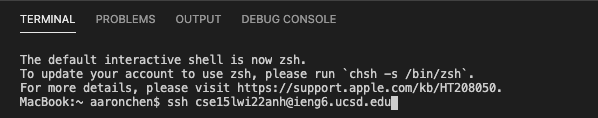
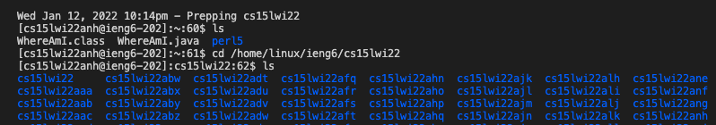
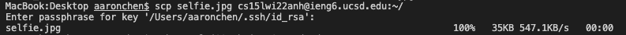
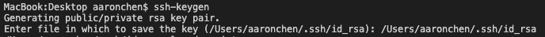
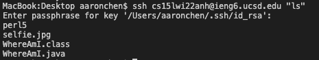

[Back to Main Page](index.md)

# Lab Report #1 &nbsp; tutorial for account log in

> by Jialin Chen 01/13 2022

1. ***Installing VScode***
    * go to [VScode](https://code.visualstudio.com) and click on download

    

    * then find the correct version and follow the instructions to install

2. ***Remotely Connecting***

    * open a new file and open up the Terminal

    * type in `cse15lwi22***@ieng6.ucsd.edu`

        * where *** should be your own course-specific account

    

    * then fill in your password to log in

3. ***Trying Some Commands***

    * try some commands such as `ls` to show all the files' name under current directory

    

4. ***Moving Files with scp***

    * type in `scp fileName cs15lwi22***@ieng6.ucsd.edu:~/`

        * replace fielName with corresponding file name 

        * *** should be your own course-specific account

    

    *  fill in your password to complete this step
    
5. ***Setting an SSH Key***

    * type in `ssh-keygen` on your local client and follow the promts to complete the set up

    

    * log on to your server

    * make .ssh directory by typing in `mkdir .ssh`

    * exit the server
    
    * copy your public key to the .ssh directory with 

        * `scp publicKeyFile cs15lwi22***@ieng6.ucsd.edu:~/.ssh/authorized_keys`

            * replace publicKeyFile with corresponding file location 

            * *** should be your own course-specific account

6. ***Optimizing Remote Running***

    * write commands at the end of `ssh` command to directly running it on the remote server

    

*Source: [ucsd CSE 15L wi22](https://ucsd-cse15l-w22.github.io/week/week1/)*

[Back to Main Page](index.md)