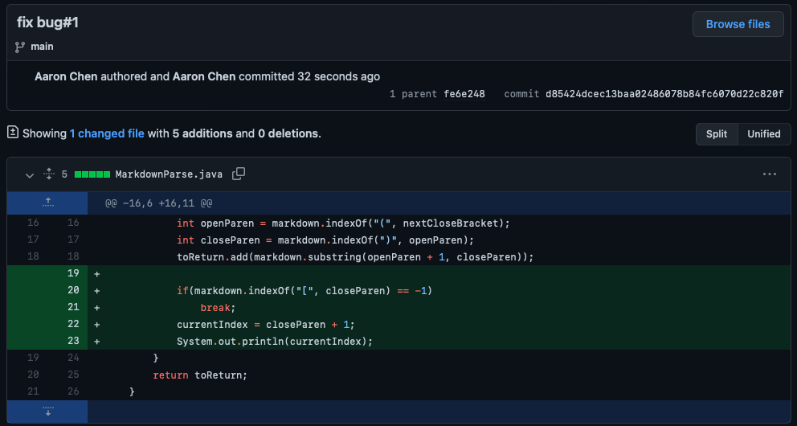

[Back to Main Page](index.md)

# Lab Report #2 &nbsp; Testing & Fixing

> by Jialin Chen 01/27 2022

## *Bug #1*

* 

* [test1_link](https://github.com/jialinc1206/markdown-parse/blob/99cbc891d4efbd30b8feaa2f1493e8249428effa/test1.md)

* 

* 

## *Bug #2*

* 

* [test2_link]()

* 

* 

## *Bug #3*

* 

* [test2_link]()

* 

* 

*Source: [ucsd CSE 15L wi22](https://ucsd-cse15l-w22.github.io/week/week4/#lab-tasks)*

[Back to Main Page](index.md)