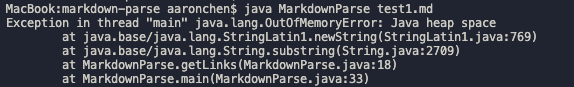
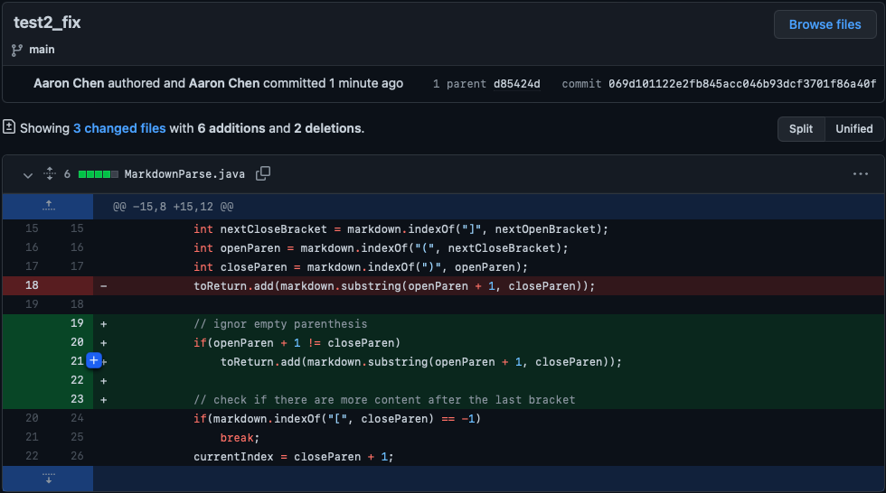

[Back to Main Page](index.md)

# Lab Report #2 &nbsp; Testing & Fixing

> by Jialin Chen 01/27 2022

## *Bug #1*

* 

* [test1_link](https://github.com/jialinc1206/markdown-parse/blob/99cbc891d4efbd30b8feaa2f1493e8249428effa/test1.md)

* 

*   bug: `currentIndex` is the same as the index of the last close parenthesis from the file. 
    While loop ends when index equals file length.

    symptom: while loop won't stop running causing `OutOfMemeoryError`

    failure-inducing input: extra character after the last close parenthesis

## *Bug #2*

* 

* [test2_link](https://github.com/jialinc1206/markdown-parse/blob/069d101122e2fb845acc046b93dcf3701f86a40f/test2.md)

* 

*   bug: the code add anything within open and close parenthesis to the `toReturn` String

    symptom: `toReturn` would contains an empty element

    failure-inducing input: emtpy pair of parenthesis

## *Bug #3*

* 

* [test3_link](https://github.com/jialinc1206/markdown-parse/blob/0de6d5611c552a0973fd33b46c185e54371ba2e9/test3.md)

* 

*   bug: the code directly finds the first bracket without checking if there is a exclamation mark before it

    symptom: image file is also included in `toReturn` String

    failure-inducing input: a line importing a image in the file

*Source: [ucsd CSE 15L wi22](https://ucsd-cse15l-w22.github.io/week/week4/#lab-tasks)*

[Back to Main Page](index.md)