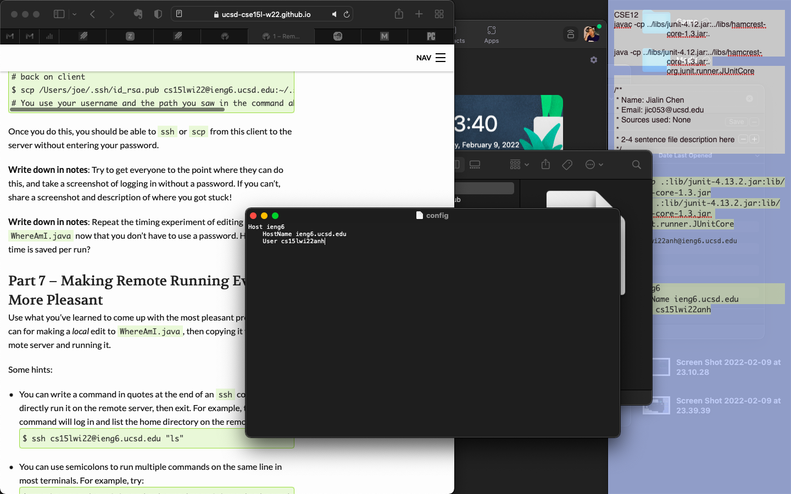
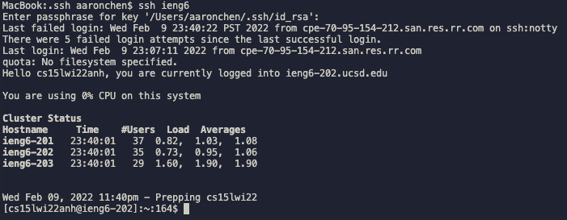

[Back to Main Page](index.md)

# Lab Report #3 &nbsp; Streamlining ssh Configuration

> by Jialin Chen 02/09 2022

## 1 &nbsp; `.ssh/config` file

* 

* create a file under `.ssh` directory and record corresponding User Name and Host Name

## 2 &nbsp; `ssh` command

* 

* use the created User Name to log into the server

## 3 &nbsp; `scp` command

* 

* now the server address can be replaced by the User Name for every command

*Source: [ucsd CSE 15L wi22](https://ucsd-cse15l-w22.github.io/week/week5/#group-choice-2-set-up-github-access-from-ieng6)*

[Back to Main Page](index.md)