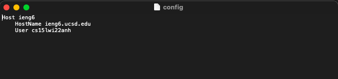

[Back to Main Page](index.md)

# Lab Report #3 &nbsp; Streamlining ssh Configuration

> by Jialin Chen 02/09 2022

## `.ssh/config` file

* 

* 

## `ssh` command

* 

* 

## `scp` command

* 

* 

*Source: [ucsd CSE 15L wi22](https://ucsd-cse15l-w22.github.io/week/week5/#group-choice-2-set-up-github-access-from-ieng6)*

[Back to Main Page](index.md)