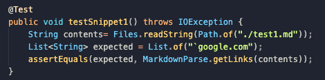

[Back to Main Page](index.md)

# Lab Report #4 &nbsp; Debugger

> by Jialin Chen 02/25 2022

* link to my [*markdown-parse*](https://github.com/sm52/markdown-parse)

* link to group's [*markdown-parse*](https://github.com/sm52/markdown-parse)

## Snippet 1

* 

* 

* the test passed for my implementation and for group implementation

* 

## Snippet 2

* 

* 

* 

* 

* 

## Snippet 3

* 

* 

* 

* 

* 

*Source: [ucsd CSE 15L wi22](https://ucsd-cse15l-w22.github.io/week/week8/#week-8-lab-report)*

[Back to Main Page](index.md)