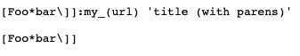
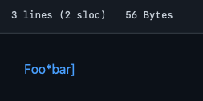
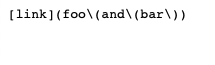
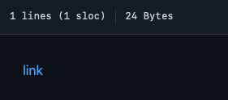

[Back to Main Page](index.md)

# Lab Report #5 &nbsp; MORE DEBUGGG

> by Jialin Chen 03/11 2022

## Test result

* Use &nbsp; `bash script.sh > XXX.txt` to store test results

* Then &nbsp; `diff XXX1.txt XXX2.txt > Diff.txt` &nbsp; to compare the two result txt files and store the comparison output in `Diff.txt`

## Test One

* [Expected Output](https://github.com/ucsd-cse15l-w22/markdown-parse/blob/main/test-files/194.md):

    *  

    * This format does not meet the requirement of a link in markdown file, so the expected out put should be `[]`

* Part of the Diff.txt:

        212c212
        < [url]
        ---
        > []

    * Upper part corresponds to result from provided implementation; lower part corresponds to result from my implementation. Therefore, the provided implementation is incorrect.
    
* Problem in the Code

    * The provided implementation did not include test to see if close bracket and open parenthesis are right next to each other when parsing.

        ```
        if (nextCloseBracket != openParen - 1) {
                currentIndex = closeParen + 1;
                continue;
            }
        ```

## Test Two

* [Expected Output](https://github.com/ucsd-cse15l-w22/markdown-parse/blob/main/test-files/497.md):

    *  

    * The expected output should be `[foo\(and\(bar\]', instead of `[]`.

* Problem in the output

    * Part of the Diff.txt:

        ```
        884c886
        < []
        ---
        > [foo\(and\(bar\]
        ```

    * Upper part corresponds to result from provided implementation; lower part corresponds to result from my implementation. Therefore, the provided implementation is incorrect.

 * Problem in the code

    * The code of provided implementation cannot correctly perform the close parenthesis search when there are more open parenthesis than close parenthesis, as shown in the following code from provided implementation:
        ```
        if(openParenCount == 0) {
                return closeParen - 1;
                }
                else {
                return -1;
                }
        ```

*Source: [ucsd CSE 15L wi22](https://ucsd-cse15l-w22.github.io/week/week10/#lab-report-5)*

[Back to Main Page](index.md)